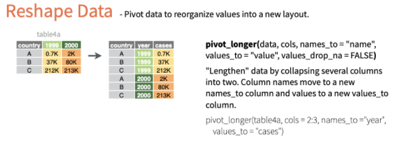

```{r setup, include=FALSE}
knitr::opts_chunk$set(echo = TRUE)
```

# Background:

The data set consists of a sample of n = 154 students attending three
postgraduate programmes (affective disorders AF, clinical
neuropsychiatry CN, and mental health studies MH), at the IoPPN in 2017.
In this dataset you will find the following variables:

-   programme: the programme the students were attending (1: AF, 2:CN,
    3:MH)
-   group: the teaching group (1: AF and CN, 2: MH)
-   anx: the scores on the 'anxiety related to statistics' scale, which
    the students completed during the first week of Term 1.
-   catgrade: the ability category (with respect to statistics) at which
    each student belonged at the beginning of the term, based on the
    Prior Knowledge Quiz\
    (1: Low, 2: Sufficient, 3: Good, 4: High).
-   quiz1: the grades on the practical quiz 1, which the students
    completed on KEATS
-   quiz2: the grades on the practical quiz 2, which the students
    completed on KEATS

## Loading Packages

```{r}
library(foreign)
library(tidyverse)
library(car) # Remember to install the package 'car' if you do not have it yet!
library(gmodels) # Also install the package 'gmodels' if you do not have it!
library(psych)
```

## Loading data

```{r}
url <- 'https://github.com/fans-stats/intro_to_R_stats/blob/main/datasets/postgraduate_dataset.SAV?raw=true'

```

# Task 1

First, identify the type of each variable in the dataset.

programme is a categorical nominal variable group is a categorical
nominal (binary) variable anx is a numerical continuous variable
catgrade is a categorical ordinal (4 points) variable quiz1 is a
numerical continuous variable quiz2 is a numerical continuous variable

# Task 2

Fill in the blanks to appropriately describe the data.

```{r}

```

In the sample, there are 19 (12.3 %) students from the affective
disorders programme, 28 (18.2 %) students from the clinical
neuropsychiatry, and 107 (69.5 %) students from the mental health
programme. With respect to their prior knowledge in statistics, 13 (8.4
%) students started their training with low prior knowledge, 56 (36.4 %)
students started with sufficient prior knowledge, 53 (34.4 %) students
started with good prior knowledge, 15 (9.7 %) students started with high
prior knowledge, and 17 (11.0 %) students did not take the test.

Regarding the 'anxiety related to statistics' scale, the students'
scores were normally distributed with mean anxiety = 35.2 (sd = 16.4,
min = 0, max = 70). The scores for both Progress Quizzes were negatively
skewed, with most students scoring towards the upper end of the
distribution. Specifically, the median for first Quiz was 75.0 (min =
15.9 - max = 95.5) and the median for second Quiz was 82.5 (min = 12.5 -
max = 100.0).

# Task 3

Based on the summary, for which of the variables you would use
parametric and for which non-parametric tests?

parametric tests: anxiety scores non-parametric tests: quiz 1 and quiz 2
scores

# Task 4

Use the appropriate test to see if there are statistically significant
differences between the two teaching groups (AD&CN and MH) in the
percentages of students belonging to each of the 'prior knowledge'
categories (low, sufficient, good, high). Report on the results.

```{r}
# First we look at the crosstables using the CrossTable() function from package 'gmodels'.

```

```{r}
# This performs Fisher's exact test
```

```{r}

```

For two independent groups, the appropriate test is Pearson's chi
square, provided the assumptions of the test hold. However, the
assumptions did not hold, so we report instead on the Fisher's exact
test.

The was no association between the group membership and the level of
prior knowledge in statistics (Fisher's exact test p=0.393).

# Task 5

Use the appropriate test to see if there are statistically significant
differences between the student's results on Progress Quiz 1 and
Progress Quiz 2. Was there any improvement?

First, create a variable of the difference between the two quizzes.

```{r}
# The function mutate() is part of the tidyverse set of packages and includes another column to your tibble(dataframe) in a similar fashion to formulas in Excel.
```

Now let's visualise the distribution:

```{r}

```

We should then perform the Wilcoxon signed rank test

```{r}

```

Differently from SPSS, R does not provide the Standardised Test
Statistic. This needs to be computed separately as follows:

```{r}

```

The students scored higher in Quiz 2 than Quiz 1 (Quiz 1 median = 75.0;
Quiz 2 median = 82.5). This was a significant difference, according to
the Wilcoxon signed rank test (Z = 4.972, p \< 0.001).

# Task 6

Use the appropriate test to see there were statistically significant
differences between the two teaching groups with respect to their
performance in the progress quizzes.

First, create histograms for both quizzes, split by group with the
function *pivot_longer()*. An illustration of pivot longer in shown in
the diagram below:

{width="700"}

> Source: <https://github.com/rstudio/cheatsheets/blob/master/tidyr.pdf>

```{r}


# Pivot longer is also included in tidyverse and was developed to convert 'wide' data structures to 'long' tibbles. 

# names_to = 'Test' defines the grouping variable column name
# values_to = 'Scores' defines the measures variable column name
```

```{r}

```

The distributions are skewed, so we must use the Mann-Whitney U test (as
opposed to the independent samples t test).

```{r}

```

```{r}

```

There were no statistically significant differences in progress quiz
scores between the two groups, according to the Mann-Whitney U test
(Quiz 1: U = 2515.5, p = 0.685; Quiz 2: U = 1504, p = 0.991).

# About ggplot2

This is a series of code snippets and figures showing the evolution of a
simple histogram in ggplot to a publication-ready image.

We start with a very basic histogram:

```{r}

```

And add some colours!

```{r}

```

We can also remove the stacking and add transparency

```{r}


# The argument position="identity" to geom_histogram() removes the stacking
# The argument alpha adds transparency ranging from 0 to 1 - with 0 indicating complete transparency and 1 relating to no transparency at all.
```

We can also change the colour palette to better suit our data:

```{r}


# scale_fill_manual(values = c('red', 'blue')) does change the colour palette. There are several colour palette functions - we should discuss them in the following weeks.
```

It is a good practice to include good labeling for our figures:

```{r}


# xlab('Quiz 1 score') defines the title of label x
# ylab('Frequency') defines the title of label y
```

We can also add a title to our legend

```{r}


# name = 'Group', included in scale_fill_manual() defines the name of the colour legend.
```

Sometimes transparencies do not work very well and panels are a better
option to split data in groups.

```{r}


# facet_wrap(~group) splits our histogram in two panels based on the variable group.
```
